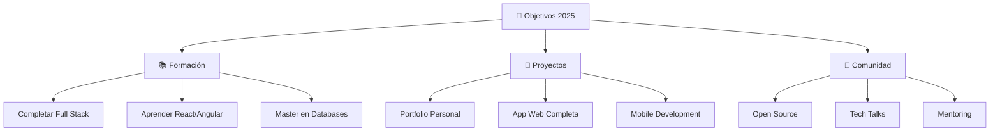

<!-- Header con animación personalizada -->
<div align="center">
  
</div>

<!-- Typing Animation personalizada -->
<div align="center">
  
</div>

<!-- Profile Image con efecto hover -->
<div align="center">
  
</div>

<br>

<!-- Animated Snake eating commits -->
<div align="center">
  
</div>

---

## 🌐 **Conecta Conmigo**

<div align="center">
  
[](https://www.instagram.com/richoflucky/profilecard/?igsh=MTh6ZmtxeDR1d2x3eA==)
[](https://www.facebook.com/richoflucky?mibextid=ZbWKwL)
[](https://discord.com/users/joserico_)
[](https://discord.gg/REqSYkHg)


</div>

---

## 🎨 **Sobre Mí**

<div align="center">

```typescript
interface Developer {
  name: string;
  location: string;
  currentStatus: string;
  languages: string[];
  databases: string[];
  passion: string[];
  currentlyLearning: string[];
  funFact: string;
  lifePhilosophy: string;
}

const joseRico: Developer = {
  name: "Jose Rico",
  location: "España 🇪🇸",
  currentStatus: "Building the future, one line at a time",
  languages: ["Python 🐍", "C# 💎", "Java ☕"],
  databases: ["MongoDB 🍃", "MySQL 🐬"],
  passion: ["Clean Code", "Problem Solving", "Innovation"],
  currentlyLearning: ["Full Stack Development", "Software Architecture"],
  funFact: "I debug with print statements and I'm proud of it! 😄",
  lifePhilosophy: "Code with purpose, learn with passion ✨"
};
```

</div>

---

## 🛠️ **Arsenal Tecnológico**

<div align="center">

<!-- Animated Tech Stack -->


</div>

<br>

<details>
<summary>📊 <b>Distribución de Habilidades</b></summary>
<br>

```text
Python          ████████████████████  95%
C#              ████████████████░░░░  80%
Java            ███████████████░░░░░  75%
MongoDB         ██████████████░░░░░░  70%
MySQL           ████████████░░░░░░░░  60%
Git/GitHub      ████████████████░░░░  80%
Problem Solving █████████████████████  100%
```

</details>

---

## 🏆 **Proyectos Destacados**

<div align="center">

<!-- Custom Project Card -->
<table>
<tr>
<td width="50%">

### 🎮 Dead Cells Database
[](https://github.com/RMJGLUCKY27/DEAD_CELLS-DATABASE)

**🎯 Mi primer gran proyecto**

Un sistema completo de gestión de datos para Dead Cells que incluye:
- 📊 Base de datos estructurada
- 🎭 Gestión de personajes y enemigos
- 🗺️ Mapeo de niveles
- 🎒 Inventario de objetos

</td>
<td width="50%">

### 🚀 Próximos Proyectos

```python
upcoming_projects = [
    {
        "name": "Portfolio Web",
        "tech": ["HTML", "CSS", "JavaScript"],
        "status": "In Planning",
        "completion": "25%"
    },
    {
        "name": "Task Manager App",
        "tech": ["Python", "MongoDB"],
        "status": "In Development",
        "completion": "10%"
    }
]
```

*¡Mantente atento a las actualizaciones!* 👀

</td>
</tr>
</table>

</div>

---

## 📈 **GitHub Analytics**

<div align="center">
  
<!-- GitHub Stats with custom theme -->


</div>

<div align="center">
  
</div>

<!-- Activity Graph -->
<div align="center">
  
</div>

---

## 🎯 **Roadmap 2025**

<div align="center">



</div>

---

## 🔥 **Featured Stats**

<div align="center">

<!-- Animated counters -->


</div>

---

## 💡 **Random Dev Quote**

<div align="center">


</div>

---

## 🎵 **Coding Soundtrack**

<div align="center">

[](https://open.spotify.com)

*🎧 Lo que escucho mientras programo*

</div>

---

## 📊 **Weekly Development Breakdown**

<!--START_SECTION:waka-->
```text
No activity tracked this week
```
<!--END_SECTION:waka-->

---

## 🏅 **GitHub Trophies**

<div align="center">


</div>

---

## 🌟 **Let's Connect & Collaborate**

<div align="center">

### 💬 ¿Tienes una idea genial? ¡Hablemos!

[](mailto:tu-email@gmail.com)
[](https://t.me/tu-usuario)

---

### 🎯 *"La mejor manera de predecir el futuro es inventándolo"* - Alan Kay

**¡Gracias por visitar mi perfil! 🚀 Siempre abierto a nuevas oportunidades y colaboraciones.**

</div>

---

<!-- Footer Animation -->
<div align="center">
  
</div>

<!-- Matrix Rain Effect -->
<div align="center">
  
</div>
